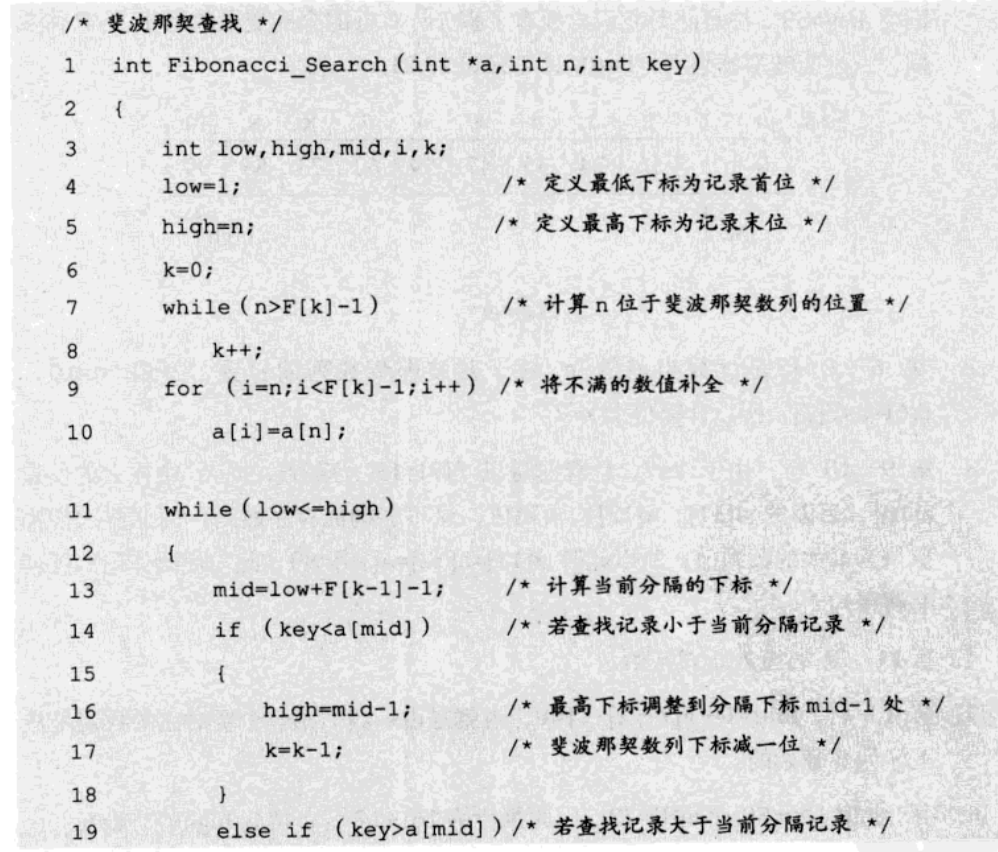
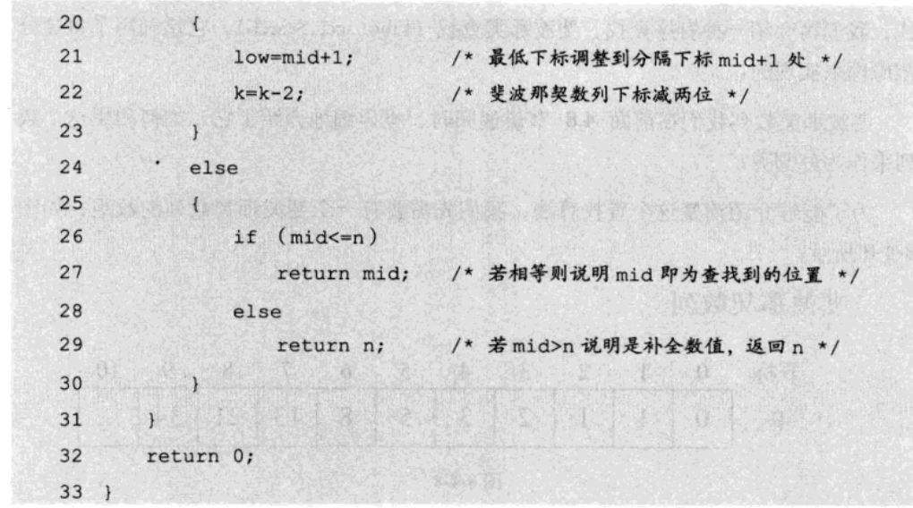
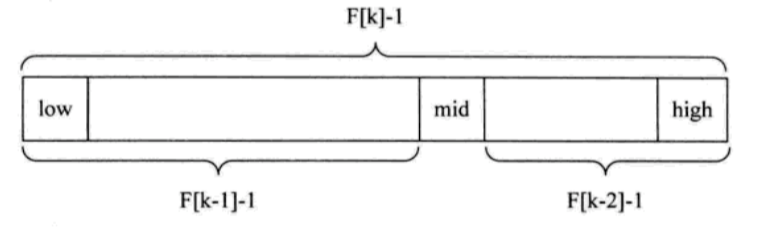

## 查找算法

查找表按照操作方式可分为静态查找表和动态查找表.

静态查找表: 只做查找操作的查找表.

动态查找表: 在查找的过程中同时存在插入表或者删除表中元素的操作.


## 1. 静态查找

### 1.1 顺序查找

从表的第一个元素开始, 逐个和需要查找的key做对比, 如果某个记录和key相等就表示查找成功, 如果查到最后一个元素还都和key不相等, 表示查找失败.

```c
int suquenceSort(int a) {
    int array[] = {9, 2, 5, 8, 3, 7, 4, 1, 6, 2};
    size_t arr_size = sizeof(array) / sizeof(array[0]);
    
    for (int i = 0; i < arr_size; i++) {
        if (array[i] == a) {
            return 1;
        }
    }
    return 0;
}
```

顺序查找适用于存储结构为顺序存储和链式存储的线性表.

顺序查找不需要要求表中的数据有序, 所以是无序查找.

时间复杂度为O(n).


### 1.2 折半查找

折半查找有称为二分查找, 它的前提是线性表中的必须是有序的, 线性表必须使用顺序存储.

```c
int binarySort(int a) {
    int array[] = {1, 2, 2, 3, 4, 6, 7, 8, 9, 20};
    size_t arr_size = sizeof(array) / sizeof(array[0]);
    
    int left = 0, right = (int)arr_size - 1;
    int mid = (left + right) / 2;
    
    while (left <= right) {
        mid = (left + right) / 2;
        if (a == array[mid]) {
            return 1;
        }else if (a < array[mid]) {
            right = mid - 1;
        }else if (a > array[mid]) {
            left = mid + 1;
        }
    }
    return 0;
}
```


### 1.3 插值查找

折半查找存在的问题:

为什么一定要折半, 而不是四分之一或者更多呢?

插值查找是对二分查找的优化, 二分查找的计算公式如下:

 `mid = (left + right)/2 = lfet + (right - left)/2;`

插值查找优化, 需要查找的值为key(二分查找可以理解为key刚好在中间)

 `mid = left + (right - left) * (key - array[left])/(array[right] - array[left]);`

```c
int binarySort(int a) {
    int array[] = {1, 2, 2, 3, 4, 6, 7, 8, 9, 20};
    size_t arr_size = sizeof(array) / sizeof(array[0]);
    
    int left = 0, right = (int)arr_size - 1;
    
    while (left <= right) {
        int mid = left + (right - left) * (a - array[left])/(array[right] - array[left]);
        if (a == array[mid]) {
            return mid;
        }else if (a < array[mid]) {
            right = mid - 1;
        }else if (a > array[mid]) {
            left = mid + 1;
        }
    }
    return -1;
}
```


### 1.4 斐波那契查找

斐波那契查找也是对二分查找的优化, 是利用黄金分割原理来实现的








## 2. 动态查找

### 2.1 树查找

二叉排序树, 在数据结构中已经体现


## 3. 哈希查找

哈希查找的概述

### 3.1 哈希函数的构造方法


### 3.2 冲突处理


### 3.3 哈希查找的实现


