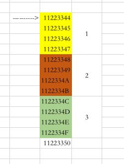
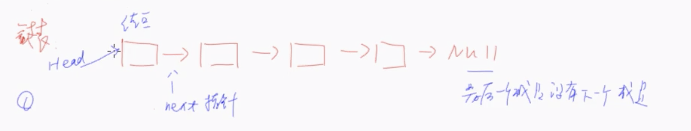
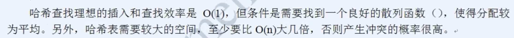

#  数据结构

数据是存放在内存中的, 数据的存放方式有两种: 顺序存放和链式存放.

顺序存放一般申请一段连续的内存空间(可以理解为一个固定长度的数组), 将数组顺序存放在数组中.

链式存放是使用分散空间, 每次申请一个固定大小的结点, 结点中可以存放数据和指针(指向前后结点).

时间复杂度和空间复杂度是衡量算法的指标, 时间复杂度是算法执行耗费的时间, 空间复杂度是占用的内存.


## 1. 线性表

线性表分为顺序存储和链式存储

### 1.1 顺序存储-数组

顺序存储(数组)的管理

```c
int a[100];// 在内存中申请100个连续的内存空间
int *p = malloc(100 * sizeof(int));// 在堆内存中申请100个连续的内存空间
```



> 数组在内存中的分布如上图所示, int类型占用4个字节, 数组地址其实就是第一个元素的地址
>
> 数组为什么存储的数据类型必须一致? 因为根据类型去分配存储空间
>
> 时间复杂度为O(1), 假如要取第10个元素, 直接根据数组的地址再根据数组数据类型计算出元素地址.

顺序存储的优缺点:

1. 查找方便, 时间复杂度O(1)
2. 添加删除不方便, 时间复杂度O(n)

数据类型定义

```c
// 存储空间, 定义长度
#define MAXSIZE 30
// 定义线性表中的元素(这里假定元素为int类型)
typedef int Element;
// 定义线性表数据类型
typedef struct {
    Element data[MAXSIZE];
    int length;
}List;
```

创建线性表

```c
// 创建线性表
Status initList(List *l) {
    l->length = 0;
    return OK;
}
```

线性表插入

```c
// 插入
Status insertElement(List *l, int i, Element e) {
    // 线性表未满
    // 插入范围正常
    if (l->length >= MAXSIZE){
        return ERROR;
    }
    if (i < 1 || i > MAXSIZE || i > (l->length + 1)) {
        return ERROR;
    }
    
    // 插入的位置在中间(需要将元素向后转移)
    if (i <= l->length) {
        for (int k = l->length; k >= i; k--) {
            l->data[k] = l->data[k - 1];
        }
    }
    
    // 将元素插入到对应位置
    l->data[i - 1] = e;
    l->length++;
    
    return OK;
}
```

线性表删除

```c
// 删除
Status deleteElement(List *l, int i, Element *e) {
    // 线性表不为空
    if (l->length <= 0) {
        return ERROR;
    }
    // 删除范围正常
    if (i < 1 || i > l->length) {
        return ERROR;
    }
    
    *e = l->data[i - 1];
    
    // 如果删除的不是最后一个
    if (i < l->length) {
        int k;
        for (k = i - 1; k < l->length - 1; k++) {
            l->data[k] = l->data[k + 1];
        }
    }
    l->length--;
    
    return OK;
}
```


### 1.2 链式存储-链表

链表结构

结点数据

```c
typedef struct Tag_Node {
    Element data;// 节点存储的数据
    struct Tag_Node *next;// 指向下一个节点
}Node;
```

```c
// 定义链表, 指向结构体的指针, 个人理解相当于head
typedef Node *LinkList;
```

添加结点

```c
// linkList是头指针
Status listInsert(LinkList *linkList, int i, Element e) {
    
    LinkList p, s;
    int j = 1;
    p = *linkList;// 头结点
    
    // 查找第i-1个节点
    while (p && j < i) {
        p = p->next;
        j++;
    }
    
    // 如果未查找到
    if (!p || j > i) {
        return ERROR;
    }
    
    // 创建节点
    s = malloc(sizeof(Node));
    s->data = e;
    s->next = p->next;
    p->next = s;
    
    return OK;
}
```

删除结点

```c
Status listDelete(LinkList *linkList, int i, Element *e) {
    LinkList p, s;
    int j = 1;
    p = *linkList;// 头结点
    
    // 查找第i-1个元素
    while (p->next && j < i) {
        p = p->next;
        j++;
    }
    
    // 如果未找到第i个元素
    if (!(p->next) || j > i) {
        return ERROR;
    }
    
    // 找到第i个元素
    s = p->next;
    p->next = s->next;
    *e = s->data;
    
    return OK;
}
```

### 1.3 数组和链表对比

数组和链表都是数据存储的方式, 但是数组只能存储固定大小的数据, 并且添加和删除不方便, 但是优势在于查找方便, 查找的时间复杂度为O(1).

链表方便添加和删除, 但是查找的时间复杂度为O(n).

在实际应用中应该结合数组和链表的特点, 用数组记录某个结点的地址, 根据某种映射关系, 用链表来组织这些数据的存放, 这样既可以快速定位位置, 又可以方便的添加和删除.


## 2. 栈和队列

栈和队列是两种特殊的数据管理方式.

栈是FILO, 先入后出, 只允许在栈顶添加和删除元素, 出栈和入栈.

队列是FIFO, 先入先出, 只允许在队首取元素, 在队尾添加元素.

### 2.1 栈

栈怎么来组织数据? 连续内存空间还是链式

连续的内存空间, 空间有上限, 假如申请了100个, 如果存储到101个数据的时候就会出现栈溢出的情况.

链式存储空间, 需要分配指针, 并且查找时间复杂度为O(n), 效率会低.

因为栈只有push和pop操作, 只能在栈顶操作元素, 所以在实际应用中, 栈的一般是使用连续的存储内存空间.

数据类型定义

```c
#define MAXSIZE 100
typedef int Status;// Status是函数的类型,其值是函数结果状态代码，如OK等
typedef int Element;
typedef struct {
    Element data[MAXSIZE];
    int top;
}SqStack;
```

初始化栈

```c
// 初始化
Status initStack(SqStack *s) {
    s->top = -1;
    return OK;
}
// 销毁, 清空
Status clearStack(SqStack *s) {
    s->top = -1;
    return OK;
}
```

入栈

```c
// push
Status push(SqStack *s, Element e) {
    // 栈满
    if (s->top >= MAXSIZE - 1) {
        return ERROR;
    }
    
    s->top++;// 栈顶指针加1
    s->data[s->top] = e;
    
    return OK;
}
```

出栈

```c
// pop
Status pop(SqStack *s, Element *e) {
    // 空栈
    if (s->top == -1) {
        return ERROR;
    }
    *e = s->data[s->top];
    s->top--;
    
    return OK;
}
```

### 2.2 栈的应用

栈的一个作用是实现递归.

栈的另一个经典应用是四则运算.

中缀表达式: 9 + (3 - 1) * 3 + 10 / 2

中缀表达式转为后缀表达式规则: 如果遇到数字直接输出, 如果遇到符号就和当前栈顶的元素符号优先级做对比, 如果当前符合是右括号或者不高于当前栈顶符号的优先级, 那就将栈顶符号出栈并输出, 再将当前符号进栈, 直到输出最终表达式.

后缀表达式: 9 3 1 - 3 * + 10 2 / +

后缀表达式计算规则: 遇到数字就进栈, 遇到符号就将取出栈顶两个元素做运算, 将运算结果进栈, 直到获取最终的结果.

### 2.3 队列

队列是只允许在一端进行插入操作, 在另一端进行删除操作的线性表.

数据类型定义

```c
typedef int Status;// Status是函数的类型,其值是函数结果状态代码，如OK等
typedef int Element;
// 定义节点
typedef struct Tag_Node {
    Element data;
    struct Tag_Node *next;// 指向下一个节点
}Node;
// 定义队列
typedef struct Tag_LinkQueue {
    Node *front;// top指针, 指向对头指针
    Node *rear;// 指向队尾指针
}LinkQueue;
```

队列初始化

```c
// 初始化
Status initLinkQueue(LinkQueue *queue) {
    // 头结点
    Node *headNode = malloc(sizeof(Node));
    headNode->next = NULL;
    if (!headNode) {
        return ERROR;
    }
    
    // 队头队尾指针指向 头结点
    queue->front = headNode;
    queue->rear = headNode;
    
    return OK;
}
```

入队列

```c
// 入队列
Status inLinkQueue(LinkQueue *queue, Element e) {
    // 创建节点
    Node *node = malloc(sizeof(Node));
    if (!node) {
        return ERROR;
    }
    node->data = e;
    node->next = NULL;
    
    // 头结点的下一个结点
    queue->rear->next = node;
    
    queue->rear = node;
    
    return OK;
}
```

出队列

```c
// 出队列
Status outLinkQueue(LinkQueue *queue, Element *e) {
    // 空队列
    if (queue->front == queue->rear) {
        return ERROR;
    }
    Node *n = queue->front->next;
    *e = n->data;
    
    // 头结点指向下一个节点
    queue->front->next = n->next;
    
    if (queue->rear == n) {
        // 删除的最后一个节点
        queue->front = queue->rear;
    }
    
    // 释放节点内存
//    free(n);
    
    return OK;
}
```


## 3. 二叉树

**树的基本概念**

根结点, 子树, 结点, 叶子结点

层次: 有多少层

深度: 层数

高度: 空树的高度为-1, 一个结点高度为0

**几种常见的二叉树分类**

斜二叉树: 也可以理解为线性表的链式存储

满二叉树: 每个结点要么有2个孩子, 要么没有

完全二叉树: 是满二叉树的一种特殊情况

**二叉排序树**

二叉树中使用最常见的是二叉排序树

二叉排序树特点: 左孩子<根节点<右孩子

### 3.1 二叉排序树的构建

二叉树的数据类型定义

```c
// 定义元素类型
typedef char Element;

// 定义结点类型
typedef struct Tag_Node {
    Element data;
    struct Tag_Node *lfet, *right;// 指向左右子结点
}Node;

// 定义二叉树, 指向结点
typedef Node *BiTree;
```

构建空二叉树

```c
// 构造空二叉树
Status initBiTree(BiTree *T) {
    *T = (BiTree)malloc(sizeof(Node));
    if (T) {
        (*T)->data = -1;
        (*T)->lfet = NULL;
        (*T)->right = NULL;
        return OK;
    }else {
        return ERROR;
    }
}
```

构建结点

```c
// 构建节点
BiTree constructNode(Element e) {
    BiTree pnode = (BiTree)malloc(sizeof(Node));
    pnode->data = e;
    pnode->lfet = NULL;
    pnode->right = NULL;
    printf("%d  ", e);
    return pnode;
}
```

将结点添加到树中

```c
// 添加结点
Status addNodeToTree(BiTree *root, BiTree newNode) {
    if ((*root) == NULL) {
        return ERROR;
    }
    // 判断根结点
    if ((*root)->data == -1) {
        *root = newNode;
        return OK;
    }
    BiTree temp = *root;
    while (temp != NULL) {
        if (temp->data > newNode->data) {
            if (temp->lfet == NULL) {
                temp->lfet = newNode;
                return OK;
            }else{
                temp = temp->lfet;
            }
        }else{
            if (temp->right == NULL) {
                temp->right = newNode;
                return OK;
            }else{
                temp = temp->right;
            }
        }
    }
    return OK;
}
```

构建二叉排序树

```c
    int testArray[7] = {100, 50, 200, 40, 80, 90, 60};
    
    BiTree tree;
    
    // 构建空二叉树
    initBiTree(&tree);
    
    // 构造二叉排序树
    for (int i = 0; i <10 ; i++) {
        Element e = testArray[i];
        BiTree node = constructNode(e);
        addNodeToTree(&tree, node);
    }
    printf("\n");
    printf("二叉排序树构建完成\n");
```

### 3.2 二叉排序树的遍历

前序: 根->左->右

中序: 左->根->右

后序: 左->右->根

递归实现

```c
// 递归遍历(递归会出现函数频繁的入栈和出栈, 很可能出现栈溢出, 而且效率比较低)
void inorderRecursive(BiTree tree) {
    if (tree == NULL) {
        return;
    }
    // 这里实现的是中序
    BiTree temp = tree;
    inorderRecursive(temp->lfet);
    printf("%d\n", temp->data);
    inorderRecursive(temp->right);
}
```

非递归前序实现

```c
// 前序 非递归遍历(自己维护栈)
void inorderNoRecursive(BiTree tree) {
    if (tree == NULL) {
        return;
    }
    // 将根结点push进栈
    push(tree);
    BiTree node;
    while (1/*判断栈里边是否有数据*/) {
        // 从栈中获取结点
        node = pop();
        if (node != NULL) {
            printf("%d", node->data);
            push(node->right);
            push(node->left);
        }
    }
}
```

> 前序非递归思路: 将根结点入栈, 访问栈顶结点, 如果该结点不为空, 先将右子树进栈, 再将左子树进栈(因为pop的时候需要先pop出左子树).

非递归中序实现

```c
// 中序, 非递归遍历(自己维护栈)
void inorderNoRecursive(BiTree tree) {
    if (tree == NULL) {
        return;
    }
    BiTree root = tree;
    BiTree node;
    
    do {
        // 将根结点和左子树入栈
        while (root != NULL) {
            push(root);
            root = root->left;
        }
        
        // 访问栈顶元素
        node = pop();
        printf("%d", node->data);
        
        // 如果当前结点有右子树, 就要访问有子树内容
        if (node->right != NULL) {
            node = node->right;
        }else{
            // 如果没有右子树, 那么接下来访问栈顶的元素
            node = NULL;
        }
        
    } while (1/*判断栈里边是否有数据*/ && node != NULL);
}
```

> 将根结点入栈, 放问结点的左子树循环入栈, 获取栈顶元素(这时获取的应该是左子树的元素), 打印, 再判断当前结点是否有右子树, 如果没有右子树表示接下来就该访问栈顶元素, 将node=null, 如果有右子树就将node=node->right, 将右子树入栈

非递归后序实现

```c
// 后序, 非递归遍历(自己维护栈)
void inorderNoRecursive(BiTree tree) {
    if (tree == NULL) {
        return;
    }
    BiTree root = tree;
    BiTree node;
    
    while (root != NULL && 1/*栈不为空*/) {
        // 将左子树入栈
        while (root != NULL) {
            push(root);
            root = root->left;
        }
        
        // 取出栈顶元素
        node = pop();
        printf("%d\n", node->data);
     
        // 判断当前结点是否是栈顶节点的左子树, 如果是左子树的话, 需要先访问栈顶节点的右子树再访问栈顶节点
        if (1/**/) {
            node = 栈顶节点的右子树结点;
        }else{
            node = NULL;
        }
    }
}
```

> 后续遍历的访问顺序是左->右->根, 先将根结点入栈, 在将左子树全部入栈, 获取栈顶元素node, 访问node数据, 判断node是否是当前栈顶元素的左子树, 如果是栈顶元素的左子树就访问栈顶元素的右子树, 否则node=null, 访问栈顶节点

### 3.3 二叉排序树的查找

查找结点

删除结点

插入结点


## 4. AVL树

AVL树, 平衡二叉排序树, **所有结点的左右子树的高度差不能超过1**(为了降低查找的时间复杂度)

树的高度, 如果为空树, 高度为-1, 如果只有一个根结点, 高度为0

```c
// 树的深度
int treeDepth(BiTree T) {
    int i, j;
    if (!T) {
        return 0;
    }
    if (T->left) {
        i = treeDepth(T->left);
    }else{
        i = 0;
    }
    if (T->right) {
        j = treeDepth(T->right);
    }else{
        j = 0;
    }
    return i > j ? i + 1 : j + 1;
}
```

AVL的核心, 加入结点, 使树仍然是AVL树

### 4.1 AVL树的操作

旋转似懂非懂


## 5. hash算法

数据组织的目的是存储, 存储的目的是为了以后查找方便.

查找: 在已经存储的数据中查找到需要的数据.

1. 逐个查找 O(N)
2. 已经排序的数组存储 O(log2 N)
3. 二叉排序树 O(log2 N)

查找的时间和数量N有关系, 数据量越大, 查找需要的时间越长, 无法保证在给定的时间内绝对查找到.

如果时间复杂度和N无关系, O(1), Hash算法.




